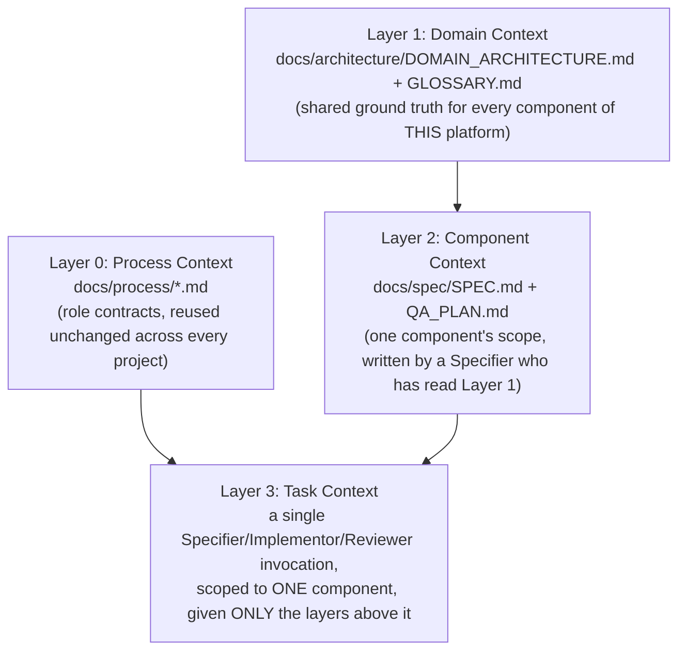
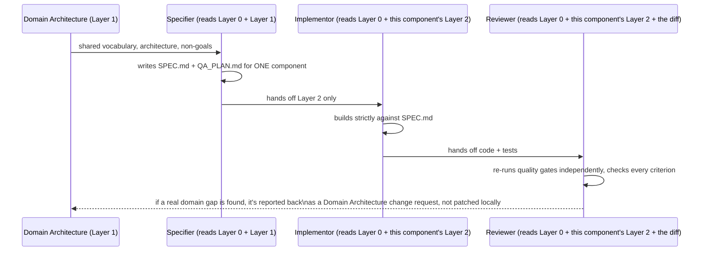

# Context Architecture: How AI Builds Against This Domain

This document describes the reusable framework, independent of fraud
detection specifically, for how AI agents are given exactly the context
they need to build one component of a larger system correctly and
consistently — without either (a) re-deriving domain knowledge from
scratch every time, drifting slightly differently each time it's derived,
or (b) being handed the entire project history as context and drowning the
actual task in irrelevant detail. This is the layer that makes "AI-built"
mean something more than "an agent wrote code from a one-line prompt."

## 1. The Problem With Flat Context

The naive approach — one agent, one prompt, "build a fraud detection
pipeline" — is what produced the first, wrong pass at this project: no
domain grounding, no shared vocabulary, no way for a second component
(say, a rules engine, built next month) to stay consistent with the first.
Handing an agent the *entire* prior conversation instead just trades that
failure for a slower, noisier one — most of a long conversation is
irrelevant to any single component.

The fix is neither "less context" nor "more context" — it's **layered,
scoped context**: each agent gets exactly the layer(s) relevant to its job,
each layer is a committed artifact (not a conversation), and layers compose
without duplication.

## 2. Layered Context Model

- **Layer 0 (Process)** answers "how do we work" — it never changes per
  component or per project. An Implementor agent always follows
  `implementor.md`'s rules regardless of whether it's building a fraud
  pipeline or the next project in the series.
- **Layer 1 (Domain)** answers "what world are we building in" — shared
  across every component of *this* platform. A Specifier writing the spec
  for, say, the Rules Engine reads `DOMAIN_ARCHITECTURE.md` and
  `GLOSSARY.md` first, so "velocity" and "step-up" mean the same thing
  there as they do in the already-built offline pipeline's spec.
- **Layer 2 (Component)** answers "what exactly does this one piece do" —
  scoped to a single component, produced by a Specifier who has Layer 1
  loaded. This is `docs/spec/SPEC.md` for the offline training pipeline
  today; a second component (e.g. the Rules Engine) gets its own SPEC.md,
  informed by the same Layer 1 but independent of Layer 2's specifics for
  other components.
- **Layer 3 (Task)** is a single agent invocation. Critically, an
  Implementor or Reviewer is given **Layer 2 and Layer 0, not Layer 1
  directly and not the conversation that produced Layer 2** — if a
  component spec is missing domain detail an Implementor needs, that's a
  Layer 2 defect to fix at the Specifier level, not something to route
  around by handing the Implementor the whole domain document to
  interpret itself. This keeps every component's implementation
  traceable to one spec, not to "whatever the domain doc implied."

## 3. The Component Build Loop

The last arrow matters: if a Reviewer finds that the spec itself was
wrong because the domain document was incomplete (e.g. it turns out a
"declined" decision needs an explanation code the domain doc never
mentioned), that's fed back as a proposed edit to `DOMAIN_ARCHITECTURE.md`
— a Layer 1 change, reviewed like any other — not a silent patch at
Layer 2 or Layer 3 that leaves the next component's Specifier working from
a domain doc that's now quietly out of date.

## 4. Why This Scales Across Components and Projects

- **Within this platform**: each row in `DOMAIN_ARCHITECTURE.md`'s Build
  Status Map becomes its own Layer 2 artifact and its own Specifier →
  Implementor → Reviewer cycle, independently — the Rules Engine component
  doesn't need the Offline Training Pipeline's SPEC.md, only the shared
  Layer 1.
- **Across projects in the series**: Layer 0 (`docs/process/`) carries
  over untouched. Layer 1 is rewritten per project (a different domain has
  a different architecture and glossary). Layers 2 and 3 are always
  project- and component-specific. This is *why* `docs/process/` was kept
  deliberately free of any fraud-detection-specific content — it's the one
  layer meant to be copied into the next repo unchanged.

## 5. What This Repo's Existing Artifacts Map To

| Artifact | Layer |
|---|---|
| `docs/process/specifier.md`, `implementor.md`, `reviewer.md` | Layer 0 |
| `docs/architecture/DOMAIN_ARCHITECTURE.md`, `GLOSSARY.md` (this pass) | Layer 1 |
| `docs/spec/SPEC.md`, `docs/spec/QA_PLAN.md` (Offline Training Pipeline) | Layer 2, for the one component currently built |
| The three agent invocations that produced `src/`, `tests/`, and `docs/qa/QA_REPORT.md` | Layer 3 |

The Layer 2 artifacts were written *before* Layer 1 existed in this
project's history — which is itself the concrete example of Section 3's
last arrow: this rewrite is the domain-architecture-change-request path,
triggered by feedback (from the human, in this case, functioning as the
Reviewer-equivalent catching a Layer 1 gap) rather than a silent patch.
Going forward, Layer 1 is written first for every new component.
