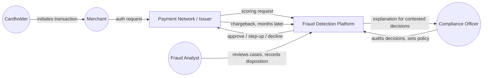
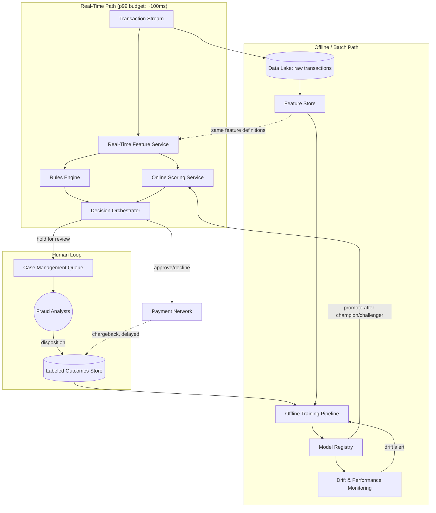
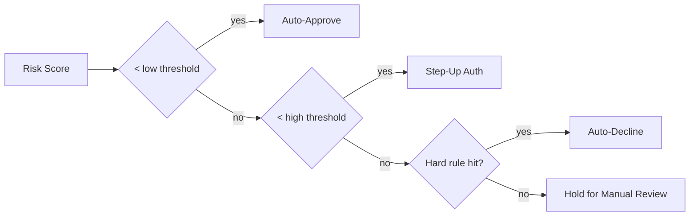

# Domain Architecture: Fraud Detection Platform

Terms used below are defined in [`GLOSSARY.md`](GLOSSARY.md). This document
describes the platform at enterprise scope. It is a **design document, not
a build log** — see Section 14 for exactly which pieces exist as running
code today versus which are architected but not yet built. Conflating the
two is the mistake this document exists to prevent.

## 1. Executive Summary

A fraud-detection platform's hard problem isn't "train a classifier" — it's
reconciling four things that pull against each other: a **sub-100ms
decision** has to be made with **incomplete information**, using a system
that must be **explainable enough to contest** a decision, while the
**labels needed to know if it was right** don't arrive for days to months.
Every component below exists because of one of those four tensions.

## 2. System Context

The platform sits inline on the authorization path (a real-time dependency
of every transaction) *and* is a long-lived learning system fed by
disputes and analyst judgment that arrive much later. Both roles have to
be served by the same model/rule artifacts, which is why "real-time
scoring" and "offline training" are separate components below rather than
one script with a `--mode` flag.

## 3. Component Architecture

The single most important edge in this diagram is the dashed one: the
**Feature Store must define features identically** for the real-time path
and the offline training path. If `transactions_last_24h` is computed one
way in production and a subtly different way during training, the model
silently underperforms in a way that's very hard to debug — this is
*training/serving skew*, and it's the most common real-world cause of
"the model worked in backtesting but not in prod."

## 4. Data Flow — Real-Time Path

1. A transaction arrives on the stream.
2. The Real-Time Feature Service computes/looks up features for the
   entity (card, account, device) — some computed on the fly (e.g.
   distance from home), some pre-aggregated and cached (e.g. velocity
   counters maintained incrementally, not recomputed from full history on
   every request — recomputing a 24h window from scratch per transaction
   does not meet a 100ms budget at volume).
3. Rules Engine and Online Scoring Service evaluate in parallel.
4. The Decision Orchestrator combines rule hits (which can force a decline
   regardless of model score — e.g. a sanctioned-country match) with the
   model's probability score into a final action: **approve**, **step-up**,
   **decline**, or **hold for manual review**.
5. The decision returns to the payment network within the latency budget.
   Everything after this point is asynchronous.

## 5. Data Flow — Offline / Batch Path

1. Raw transactions land in the data lake continuously.
2. The Feature Store computes historical features using the *same
   definitions* as the real-time path, but can afford full-history
   recomputation.
3. Labeled outcomes arrive from two sources at very different speeds:
   analyst dispositions (days) and chargebacks (weeks to months, and noisy
   — see *friendly fraud* in the glossary).
4. The Offline Training Pipeline — **this is the component already built
   in this repo** — retrains on the combined labeled set.
5. New model candidates are registered and run as a *challenger* against
   live traffic (scored, not decisioning) before promotion.
6. Promoted models replace the champion in the Online Scoring Service.

## 6. Detection Strategy: Hybrid Rules + ML

Neither rules nor ML alone are sufficient, for different reasons:

| | Rules Engine | ML Model |
|---|---|---|
| Explainability | Perfect — the exact condition that fired is known | Requires a separate explainability layer (e.g. SHAP) and is still probabilistic |
| Adapts to novel fraud patterns | No — only catches what a human already encoded | Yes — this is its entire value proposition |
| Handles regulatory/compliance holds (e.g. sanctioned entities) | Yes — must be deterministic for this by law/policy | No — never appropriate for a hard compliance rule |
| Time to cover a newly-discovered fraud pattern | Minutes (ship a rule) | Days to weeks (retrain, validate, promote) |
| Degrades silently | No — a rule either fires or doesn't | Yes — via drift, see Section 9 |

The Decision Orchestrator therefore treats rule hits and model scores as
**separate, composable inputs**, not a single blended number: certain rule
categories (sanctions, hard compliance blocks) bypass the model entirely
and force a decline; softer rules (heuristic risk signals) contribute to
the same risk tier as the model score.

## 7. Decisioning Tiers

Threshold placement is a **business decision informed by, not dictated by,
the model** — it trades off analyst review capacity, false-positive
customer friction, and fraud loss tolerance. This is exactly why
evaluation reports recall *at a target precision* (Section 9 of
`docs/spec/SPEC.md`) rather than a single "accuracy" number: the target
precision **is** the threshold-placement business decision, made explicit.

## 8. Case Management & Analyst Workflow

Transactions held for review enter a prioritized queue (typically by
$-value-at-risk × estimated fraud probability). An analyst sees the
transaction, its rule hits, its model score, and *why* the model scored it
that way (explainability output), then records a disposition. This is a
UI/workflow system in its own right — outside this repo's current scope,
but architected here because the labels it produces are load-bearing for
Section 9.

## 9. Feedback Loop & Retraining

Two label sources, reconciled:

- **Analyst dispositions** — fast (days), covers only the subset of
  transactions that were held for review (a *biased* sample — the model
  never gets fast feedback on transactions it auto-approved).
- **Chargebacks** — slow (weeks–months) but covers auto-approved
  transactions too, closing the bias gap above at the cost of latency and
  *friendly-fraud* label noise.

Retraining without accounting for which label source covers which
population, and its lag, is a common way these systems drift without
anyone noticing — a naive "retrain nightly on all available labels"
pipeline will systematically underweight fraud patterns that only
chargebacks (not analysts) ever catch, because those labels arrive too
late to make it into most retraining windows.

## 10. Model Governance

- **Model Registry**: every trained model version, its training data
  snapshot, hyperparameters, and evaluation metrics — the model card
  concept already implemented in this repo's offline pipeline
  (`write_model_card`), generalized to every model version, not just the
  latest.
- **Champion/challenger**: no model reaches the Online Scoring Service
  without first being scored (not decisioned) against live traffic.
- **Explainability**: every real-time score must be attributable to
  contributing features (e.g. SHAP values) at decision time, not
  computed after the fact — an analyst or a contested-decision process
  needs the *actual* reasoning, not a plausible reconstruction.

## 11. Observability & Monitoring

Distinct from ordinary system monitoring (latency, error rate, uptime),
this platform needs **model-specific** monitoring:
- Input/data drift: are incoming feature distributions shifting?
- Prediction drift: is the score distribution shifting even if inputs look stable?
- Outcome drift: is realized precision/recall (once labels catch up)
  degrading against what was measured at promotion time?
- Rule staleness: rules with a near-zero hit rate for an extended period
  (either the pattern disappeared, or fraud adapted around the exact
  condition — worth knowing which).

## 12. Compliance & Risk Considerations

These are engineering-relevant *design constraints*, not legal advice —
actual regulatory obligations depend on jurisdiction and require real
legal review:
- Decisions affecting a customer (decline, hold) commonly carry an
  obligation to be explainable/contestable — reinforces Section 10's
  explainability requirement and Section 6's case for retaining rules
  coverage.
- Audit trail: every decision, its contributing rule/model factors, and
  any later disposition must be retrievable — this is a retention and
  traceability requirement on top of, not instead of, the ML pipeline.
- Segregation of duties: the team tuning fraud rules/models should not be
  the same team whose performance is measured by the fraud-loss numbers
  those rules/models produce, to avoid an incentive to under-flag.
- Data handling: transaction data is sensitive by default; synthetic data
  is used throughout this project's *implemented* component specifically
  to avoid handling real regulated data before that governance layer
  exists.

## 13. Non-Functional Requirements

| Path | Requirement | Why |
|---|---|---|
| Real-time scoring | p99 latency ≈ 100ms | Sits inline on the authorization path; the payment network has its own timeout |
| Real-time scoring | Available even if the ML model is unreachable | Rules Engine must be able to run standalone in a degraded mode — fail toward the safer decision, not toward availability at any cost |
| Offline training | Reproducible | A model must be re-derivable from its registry entry for audit purposes |
| Feature Store | Point-in-time correct | Training must only ever see features as they would have existed at decision time — the same leakage discipline as this repo's `transactions_last_24h` design, generalized to every feature |

## 14. Build Status Map

| Component | Status | Where |
|---|---|---|
| Offline Model Training & Batch Evaluation | **Built** | `src/fraud_detection/`, specified in `docs/spec/SPEC.md`, reviewed in `docs/qa/QA_REPORT.md` |
| Synthetic transaction generator (stand-in for the Data Lake / stream in a local, no-infra project) | **Built** | `src/fraud_detection/data.py` |
| Feature computation (batch-only; point-in-time-correct velocity feature) | **Built**, batch-only | `src/fraud_detection/features.py` |
| Model Registry, champion/challenger | Architected only | This document, Section 10 |
| Real-Time Feature Service, Online Scoring Service, Decision Orchestrator | Architected only | This document, Sections 3–4 |
| Rules Engine | Architected only | This document, Section 6 |
| Case Management / analyst workflow | Architected only | This document, Section 8 |
| Drift/Performance Monitoring | Architected only | This document, Section 11 |

This map is the honest answer to "what did AI actually build here": one
real, tested, reviewed component of a much larger system that's been
designed on paper. Future projects in this series can pick up any
"Architected only" row as their own Specifier → Implementor → Reviewer
cycle, using this document as shared domain context (see
`CONTEXT_ARCHITECTURE.md`).
